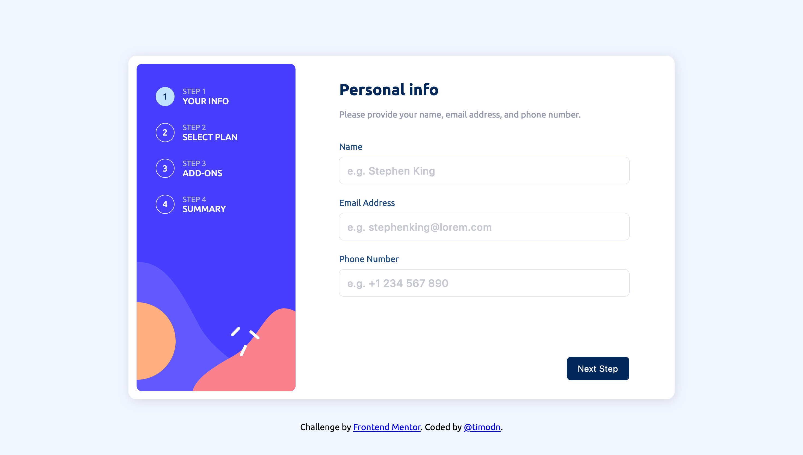

# Frontend Mentor - Multi-step form solution

This is a solution to the [Multi-step form challenge on Frontend Mentor](https://www.frontendmentor.io/challenges/multistep-form-YVAnSdqQBJ). Frontend Mentor challenges help you improve your coding skills by building realistic projects. 

## Table of contents

- [The challenge](#the-challenge)
- [Screenshot](#screenshot)
- [Links](#links)
- [Built with](#built-with)
- [What I learned](#what-i-learned)
- [Continued development](#continued-development)
- [Author](#author)

### The challenge

Users should be able to:

- Complete each step of the sequence
- Go back to a previous step to update their selections
- See a summary of their selections on the final step and confirm their order
- View the optimal layout for the interface depending on their device's screen size
- See hover and focus states for all interactive elements on the page
- Receive form validation messages if:
- A field has been missed
- The email address is not formatted correctly
- A step is submitted, but no selection has been made

### Screenshot

### Links

- Solution URL: [https://github.com/TimmyOGH/Multi-Step-Form]
- Live Site URL: [https://timmyogh.github.io/Multi-Step-Form]

### Built with

- CSS custom properties
- Flexbox

### What I learned

I learned quite a lot of advanced css and javascript usages during the challenge.

### Continued development

I want to become a master at building websites/apps by tackling frontend mentor challenges.

## Author

- Frontend Mentor - [@timodn](https://www.frontendmentor.io/profile/timodn)
# tariff-plan
# tariff-plan
# tariff-plan
